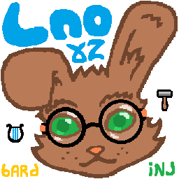

> 📖 **Русская версия:** [README.ru.md](README.ru.md)

# Lpo Ftl
Lpo Ftl: Leporish engineering language of unambiguous reductions (~2x shorter than English with the same alphabet) + Fantasy world simulator game «Fat Lizard» with Leporish-based voice synthesis

## How to use:
The main files for using the language:
- **«0 Lpo.txt»**: a dictionary with grammar rules and examples, with lemmas sorted by semantic categories. The language is intentionally limited to a single-byte Win1251 encoding. If you cannot open it in this encoding, use the file **«0 Lpo UTF8.txt»**.
- **«0 Lpo.png»**: the geometry of the alphabet and auxiliary symbols.
- **«An.ttf»**: a font with the required character geometry. Aligned to the pixel grid for 9pt at 96 DPI. There is also a monospaced version **«An1.ttf»** and a more conservative variant **«Run.ttf»**.

## Windows reader:
**«Lpo Vok.exe»**: works with the **«0 Lpo.txt»** file in the local directory and uses the installed **«An»** font. The source code is provided as a single file **«Lpo Vok.cpp»** in the **«tuli»** folder, WinAPI C++.

### Settings menu translation («st»):
- **«uv ol okn»** = always on top
- **«oi fh vd»** = whole word only
- **«xrb sns»** = case sensitive
- **«rld vok»** = reload dictionary

## [Android reader](/Lpo_Android):
The APK file is the app itself (no digital signature, sorry). The archive contains the core source code (Kotlin, Android Studio). This app requires the UTF8 version of the dictionary.
### Settings menu translation:
- **«lod vok»** = load dictionary
- **«rld vok»** = reload dictionary
- **«oi fh vd»** = whole word only
- **«xrb sns»** = case sensitive
- **«iho»** = exit

## [Additional translation examples in the «trs» folder](/trs)

## [Tools in the «tuli» folder](/tuli):
Developer tools and source code for dictionary analysis and editing. The programs read the dictionary from **«1.txt»** in the local directory.
Main files:
- **«1 qk vok fom.cpp»** - checks whether lemma lines contain the separator «==» and appends the final «=» if missing.
- **«2 omon & vd em.cpp»** - checks common words and their allomorphs for homonyms, and counts the total number of lemmas and allomorphs.
- **«3 nim em.cpp»** - counts the total number of lemmas.
- **«4 lbl bzd kmbi do 3bkv.cpp»** - marks occupied 1..3 letter word combinations and saves them to **«2.txt»**.
- **«5 bv stt.cpp»** - calculates alphabet letter frequency statistics across all lemmas and allomorphs.
- **«Lpo.h»** - contains a set of C++ macro definitions that replace common expressions with Leporish words.

## [Ftl (Fat Lizard)](/Ftl):
Game design documents for a fantasy life simulator. Planned features:
- Open sandbox world with events, small settlements, construction, and a physical economy.
- Primarily single-character control (first/third person), with party management.
- Flora and fauna editor.
- Monster hunting and settlement defense.
- Voice synthesis in Leporish, possibly with a primitive AI that understands limited free-form Leporish text.
- Full interface localization in Leporish.
